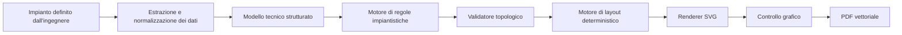

# Disegnatore MEP — contesto iniziale del progetto

Data di avvio: 1 agosto 2026  
Stato: fase di progettazione concettuale, nessuna implementazione ancora avviata.

## Obiettivo

Creare una skill capace di trasformare un impianto termotecnico già definito e dimensionato dall'ingegnere in uno schema unifilare professionale, inizialmente in formato SVG/PDF vettoriale.

La skill deve operare come un tecnico CAD esperto di disegno termotecnico. Non deve inventare o dimensionare l'impianto: deve interpretare la configurazione approvata, verificarne la completezza ai fini del disegno e produrre un elaborato conforme alle regole tecniche e grafiche codificate.

## Trascrizione consolidata della conversazione

### 1. Controllo delle applicazioni Windows

**Utente**

Abbiamo il plugin per computer use che può usare anche le app del PC. Cosa intendiamo per app? Qualunque app? Per esempio, se ho installato AutoCAD o Termolog, potrebbe impostare un disegno tecnico o creare un modello energetico di un edificio?

**Assistente**

Per “app” si intendono, in linea di massima, i programmi Windows utilizzabili tramite schermo, mouse e tastiera. AutoCAD e Termolog sono candidati plausibili, con la distinzione tra controllare l'interfaccia e svolgere correttamente la progettazione.

In AutoCAD sarebbe possibile aprire file, impostare unità e layer, tracciare e modificare oggetti, inserire quote e testi, eseguire comandi ed esportare tavole. Per lavori precisi è preferibile affiancare al controllo visivo script, AutoLISP o generazione DXF.

In Termolog sarebbe possibile creare pratiche, inserire strutture, zone, terminali e impianti, avviare calcoli ed esportare risultati. L'attendibilità dipende però dalla completezza dei dati forniti e dalla verifica finale del tecnico.

Non ogni applicazione è controllabile con identica affidabilità: interfacce personalizzate, operazioni grafiche molto fini, finestre inattese, autorizzazioni e funzioni specialistiche possono richiedere procedure dedicate.

### 2. Web app oppure applicazione desktop

**Utente**

Un'app che ha anche una versione web semplifica, complica o lascia indifferente il lavoro? È meglio lavorare su computer o su web app?

**Assistente**

La web app tende a semplificare l'automazione di moduli, tabelle e procedure guidate perché gli elementi dell'interfaccia sono spesso più facilmente riconoscibili. L'app desktop è generalmente preferibile quando servono tutte le funzioni professionali, grandi file, disegno preciso, plugin, script e collegamenti con risorse locali.

Per AutoCAD è normalmente preferibile il desktop. Per Termolog occorre scegliere la versione che contenga il motore di calcolo e tutte le verifiche necessarie. Una soluzione ibrida può utilizzare il web per raccolta e inserimento dati e il desktop per modellazione e verifica finale.

### 3. Idea della skill per schemi unifilari termici

**Utente**

Vorrei creare una skill per disegnare schemi unifilari di impianti termici. Non necessariamente in CAD: per il momento potremmo produrre direttamente un PDF. La skill dovrebbe rispettare gli standard di progettazione e le best practice, per esempio inserire le necessarie valvole prima degli accessori.

Con un normale prompt l'AI tende a fare confusione: mette le valvole a caso, non le allinea alle tubazioni e collega le macchine con una logica simile a PowerPoint, senza rispettare gli standard grafici. In rete esiste molto materiale, anche negli schemi dei grandi produttori come Caleffi. È fattibile e come potremmo impostare il lavoro?

**Assistente**

Il progetto è fattibile, ma non deve essere affidato a un generatore grafico libero. Occorre separare:

1. interpretazione tecnica dell'impianto;
2. modello strutturato della topologia;
3. applicazione di regole verificabili;
4. validazione tecnica;
5. layout deterministico;
6. rendering vettoriale SVG;
7. esportazione e controllo del PDF.

L'AI interpreta i requisiti e costruisce una rappresentazione strutturata entro limiti precisi. Un motore deterministico posiziona invece i componenti su una griglia, allinea accessori e tubazioni, evita sovrapposizioni, usa simboli ammessi e blocca l'emissione quando le verifiche falliscono.

Le conoscenze devono essere separate in:

- normativa cogente;
- regole di buona progettazione e manutenibilità;
- convenzioni grafiche.

Gli schemi dei produttori possono essere fonti tecniche e casi di studio, ma non vanno copiati indiscriminatamente. Le regole devono essere rielaborate e verificate contro fonti normative e manuali ufficiali; simboli e asset devono essere originali o utilizzabili legittimamente.

È stato raccomandato di iniziare da una famiglia limitata di impianti e ampliare la copertura soltanto dopo la validazione su casi reali.

### 4. Prima famiglia di impianti

**Utente**

Gli impianti realizzati più spesso sono:

- impianti domestici aria-acqua;
- configurazioni con volano termico a quattro tubi e radiatori;
- sistemi a due tubi con pavimento radiante o ventilconvettori;
- impianti aria-aria canalizzati;
- sistemi aria-acqua con distribuzione canalizzata.

L'utente propone di concentrarsi inizialmente su questa area e osserva che probabilmente servirà una skill consistente, con libreria di simboli, regole e numerosi script, perché la parte deterministica è essenziale per ottenere un disegno corretto.

**Assistente**

È stato concordato di trattare il lavoro come un progetto dedicato. La skill dovrà essere potente nelle capacità ma non consistere in un prompt enorme. La struttura proposta comprende:

- `SKILL.md` conciso per il workflow;
- script per topologia, validazione, layout, rendering ed esportazione;
- riferimenti per regole progettuali, grafiche, configurazioni e fonti;
- asset per simboli SVG, cartigli e modelli;
- casi di prova validi, non validi e output di riferimento.

È stato raccomandato di sviluppare prima la famiglia idronica aria-acqua. La famiglia aeraulica canalizzata richiede infatti una grammatica grafica distinta: canali, sezioni, portate, serrande, diffusori, riprese e aria esterna.

### 5. Significato del volano a quattro tubi

**Assistente**

È stato chiesto se “quattro tubi” indicasse una distribuzione caldo/freddo a quattro tubi oppure quattro connessioni sul volano termico.

**Utente**

Si intendono quattro tubi sul volano termico, usato per la disgiunzione idraulica e per poter modificare il delta T sul secondario mediante un secondo circolatore.

**Assistente**

La topologia è stata interpretata così:

- circuito primario tra pompa di calore e volano, con il proprio circolatore;
- circuito secondario tra volano e terminali, con un secondo circolatore;
- portate e delta T potenzialmente differenti;
- disaccoppiamento idraulico tra generatore e distribuzione.

Questa configurazione dovrà essere distinta dal volano a due attacchi installato in serie. Il validatore dovrà impedire la confusione tra le topologie e controllare il corretto inserimento di circolatori, sonde, intercettazioni, filtri, ritegni, dispositivi di sicurezza, scarichi e sfiati.

### 6. Esclusione del dimensionamento dalla prima versione

**Assistente**

È stato chiesto se la skill dovesse dimensionare volano, tubazioni e circolatori oppure ricevere dati già dimensionati e limitarsi alla verifica topologica e al disegno.

**Utente**

Per ora la skill non deve fare dimensionamenti. L'ingegnere definisce componenti, dimensionamenti e descrizione dell'impianto, eventualmente ragionando con GPT senza una skill specifica. Quando l'impianto è definito, richiede la generazione del layout. Da quel momento GPT deve lavorare come un tecnico CAD esperto di disegno termotecnico.

**Decisione consolidata**

Il confine della prima versione è quindi:

- nessun dimensionamento automatico;
- nessuna selezione autonoma delle apparecchiature;
- nessuna modifica silenziosa del progetto dell'ingegnere;
- estrazione della configurazione già definita dalla conversazione e/o da una scheda dati;
- normalizzazione in un modello strutturato;
- richiesta dei soli dati indispensabili mancanti;
- generazione dello schema mediante regole deterministiche;
- validazione tecnica e grafica;
- emissione SVG/PDF vettoriale;
- segnalazione esplicita di incongruenze o ambiguità.

### 7. Trasferimento in un progetto dedicato

**Utente**

Prima di proseguire è opportuno creare un progetto strutturato per non perdere il contesto. La cartella scelta è:

`C:\Users\DanielCarta\OneDrive - Carta Advice srl\NOVE C\0.Progetti\02_BaseLavoro\xRef\5.Skill Claude\DisegnatoreMEP`

## Architettura concettuale provvisoria

## Principi già approvati

1. L'AI non deve disegnare liberamente lo schema come una presentazione.
2. Ogni componente deve appartenere a una topologia esplicita.
3. Valvole e accessori devono essere elementi delle tubazioni, non oggetti grafici flottanti.
4. Posizionamento, allineamento, spaziatura e instradamento devono essere deterministici.
5. Prima del rendering deve esistere un modello strutturato verificabile.
6. Le regole tecniche devono essere codificate e testabili, non affidate unicamente al prompt.
7. La prima versione non effettua dimensionamenti.
8. L'ingegnere conserva il controllo e la responsabilità della configurazione progettuale.
9. SVG è il formato grafico intermedio preferito; il PDF è l'elaborato finale iniziale.
10. La prima famiglia da sviluppare è quella degli impianti idronici domestici aria-acqua.
11. Gli impianti aeraulici canalizzati saranno affrontati come famiglia successiva.

## Prima famiglia funzionale prevista

Configurazione principale iniziale:

- pompa di calore aria-acqua;
- circuito primario;
- volano termico a quattro attacchi con funzione di disgiunzione idraulica;
- circuito secondario con circolatore dedicato;
- distribuzione verso radiatori, pavimento radiante o ventilconvettori;
- accessori idraulici, dispositivi di sicurezza, misura, sfiato e scarico;
- mandata e ritorno chiaramente differenziati;
- direzioni dei flussi e associazione inequivocabile degli accessori alle tubazioni.

## Questioni ancora da definire

- livello di dettaglio del primo elaborato;
- dati obbligatori in ingresso prima del disegno;
- simbologia grafica e standard di riferimento;
- famiglie e varianti topologiche ammesse;
- regole di composizione e sequenza dei componenti;
- criteri grafici: griglia, distanze, colori, spessori, testi e cartiglio;
- strategia di gestione dei casi non rappresentabili;
- modalità di revisione e approvazione da parte dell'ingegnere;
- formato del modello strutturato interno;
- criteri di collaudo su schemi reali.

## Punto esatto da cui riprendere

La prossima fase è il brainstorming guidato del design. Prima di scrivere codice o creare la skill occorre definire, una decisione alla volta, il livello di dettaglio grafico e informativo dello schema finale.

Una prima distinzione utile sarà tra:

- schema funzionale essenziale;
- schema tecnico professionale con tag, diametri e caratteristiche già fornite dall'ingegnere;
- schema esecutivo molto dettagliato con tutte le intercettazioni, strumenti, punti di scarico/sfiato e annotazioni di posa.

## Prompt suggerito per riprendere in un nuovo progetto

> Stiamo progettando una skill denominata provvisoriamente “Disegnatore MEP”. Leggi integralmente `CONTESTO_PROGETTO.md` presente nella cartella del progetto e riprendi dal punto indicato, senza iniziare ancora l'implementazione. Conduci il brainstorming con una domanda alla volta. L'obiettivo iniziale è generare schemi unifilari termotecnici SVG/PDF professionali per impianti domestici aria-acqua già progettati e dimensionati dall'ingegnere, usando un motore di regole e un layout deterministico.

