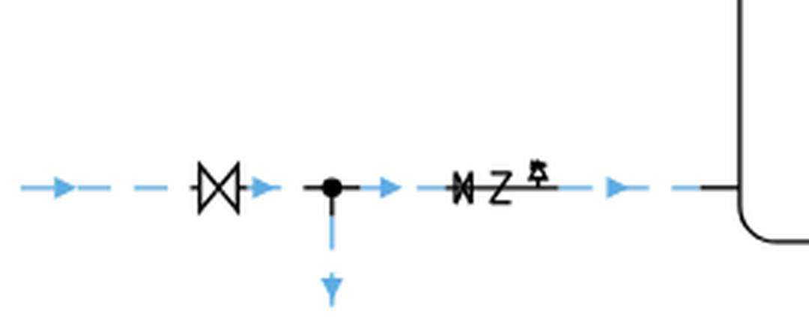

# Prova in camera pulita dell'occhio — 20 settembre 2026

Un agente avviato da zero, che riceve **soltanto** `skill/rivedere/ISTRUZIONI.md`, l'immagine
della tavola dell'impianto 5, i rilievi già misurati dai controlli e le tavole di riferimento
del disegnatore del PO. Non ha letto il codice.

## Perché questa prova esiste

Il PO, il 20 settembre 2026:

> «Il revisore ancora non capisco perché **calcola**. Dovrebbe invece vedere come faccio io.
> Come fa un agente AI, non un altro motore di calcolo, altrimenti è una copia del motore che
> instrada.»

Il metro non è «quanti difetti ha trovato»: è **se vede quello che vede il PO**, e se dice
cose che i numeri non dicono.

## Esito: due rilievi che nessun controllo poteva dare, **rieseguiti dalla sessione**

### 1. I simboli si sovrappongono, e il rilievo che c'è punta dalla parte sbagliata

Sulla **stessa linea**: a sinistra del raccordo una valvola di intercettazione disegnata
intera e leggibile; a destra, fra il raccordo e `bollitore.cold_in`, **tre organi in linea uno
dentro l'altro** — la stessa valvola schiacciata a un terzo della larghezza, il ritegno che la
tocca, un terzo simbolo appoggiato sopra. Non si capisce quanti pezzi ci sono.

L'unico rilievo su quella tratta è
`SERVICE_STUB_LONGER_THAN_ITS_MINIMUM` — «10,0 mm di tubo in più», cioè **accorciala**.
Applicarlo **peggiora** il grumo. **B5**, la regola che esiste apposta — «una tratta con più
accessori in linea vuole il proprio rettilineo» — **non si accende**.

*Verificato dalla sessione ritagliando il PNG della tavola consegnata.*

### 2. Il ritorno dell'ACS corre sopra la propria mandata, e **B10 è cieco**

Le due corsie arancio attraversano il foglio per 265 e 275 mm a **5 mm** l'una dall'altra, con
il **ricircolo — cioè il ritorno — sulla corsia alta**. `RETURN_RUNS_ABOVE_ITS_SUPPLY` si
accende tre volte altrove e **su questa coppia mai**.

*Verificato dalla sessione sulla geometria*: le due tratte `w3` e `w5` portano tutt'e due
**`supply=True`**. Il controllo cerca una mandata e un ritorno e non trova la coppia. **Non è
un difetto di B10: è il verso del ricircolo che non si ricava** (D-059), e nessun controllo
poteva accorgersene da solo.

## Che cosa ha restituito, e nella forma giusta

Quattro **vincoli** su pezzi nominati — `sulla-stessa-verticale`, `addosso-a`, `passa-per`,
`sotto` — ciascuno con la regola che lo motiva e il punto della tavola dove si vede; le
contese fra due regole dichiarate con chi cede; e **quattro domande** al PO invece di quattro
invenzioni, fra cui una convenzione grafica (quale collettore sta più vicino alle macchine)
che ha esplicitamente rifiutato di decidere.

**Nessuna piega e nessun millimetro ricontato**, come `ISTRUZIONI.md` §1 pretende.
